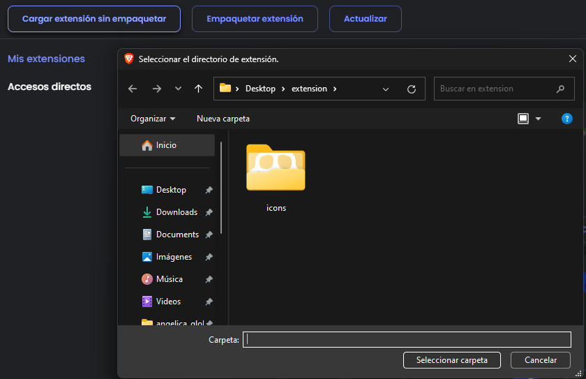

# YouTube Downloader

Este proyecto es una aplicación web desarrollada en Python utilizando Flask para descargar videos desde YouTube en formato MP3 o MP4.

## Funcionalidades

- Descarga de videos en formato MP3.
- Descarga de videos en formato MP4 en la mejor calidad disponible.

## Requisitos Previos

Para ejecutar este proyecto localmente, necesitarás tener instalado Python y algunas bibliotecas de Python. Puedes instalar las dependencias usando pip:

```
py -m pip install Flask Flask-Cors pytube moviepy
```


Asegúrate de tener permisos para escribir en las carpetas de música y videos especificadas en el código.

## Configuración

1. Clona el repositorio:

```
git clone https://github.com/KevinGil12C/extension.git

cd extension
```


2. Configura el servidor Flask:

```
py main.py
```


Esto iniciará el servidor en `http://localhost:8000`.

3. Agregar extensión en navegador 


## Uso

Una vez que el servidor esté en funcionamiento, puedes enviar solicitudes POST para descargar videos. 

### Descargar en MP3 o MP4


###Descargar ffmpeg
winget install "FFmpeg (Essentials Build)"

## Contribuciones

Las contribuciones son bienvenidas. Si deseas mejorar este proyecto, por favor abre un problema o envía una solicitud de extracción.

## Licencia

Este proyecto está licenciado bajo la Licencia MIT. Para más detalles, consulta el archivo LICENSE.